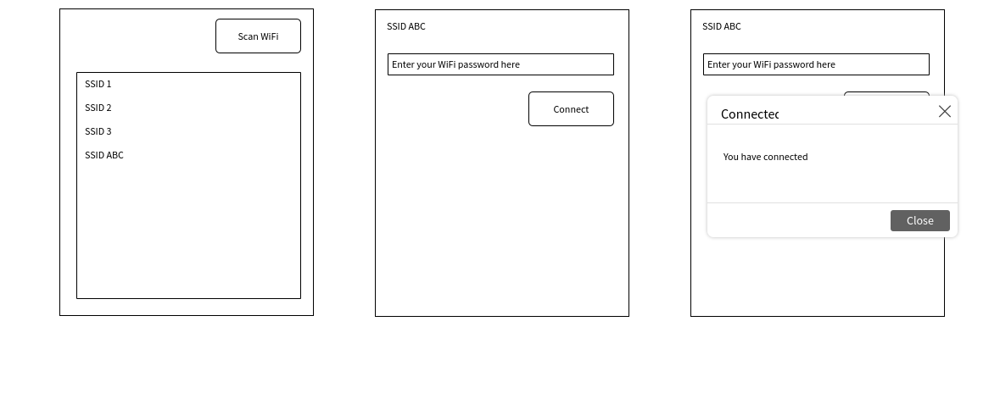

# QT Software Engineer test

This test aims to test your ability to come up with innovative solutions to problems. The following tasks should take no longer than 45-60min. 

Please commit your solution to your **Github** repository as your commits pattern will be assessed as well. Once you have completed the quiz, do share to us the link to the repository.

Please note that we are evaluating based on the quality of code & solution, __not__ the aesthetic of the graphical user interface (GUI). We will be testing your solution in a Linux operating system.

We expect the use of the following:
- `NetworkManagerQt` (https://api.kde.org/frameworks/networkmanager-qt/html/index.html)
- `QtQML` 

## Task 1
Please create a GUI to perform a WiFi scanning, displaying all the visible WiFi SSIDs in a list. The GUI should contain the following functional features:
- A `button` to initiate scanning of WiFi
- WiFi detected should be printed on a `ListView`
- Each item on the list should display the `SSID` of the WiFi.

## Task 2
Now that you are able to list the WiFi SSIDs, you will need to allow user to establish authentication with the selected WiFi SSID.

We expect the following:
- When user click on any item (WiFi SSID) on the list, it will then transition into the authentication interface, where the user can enter the WiFi password.
- Clicking the `Connect` button should then allow the device to attempt network establishment. You can assume all WiFi are protected using `WPA-PSK` protocol.
- There should be some user interface to inform user on the successfulness of the attempt, such as a simple popup.

## Sample mockup
_**You are not required to adhere to the layout of the following mock-up.**_ Feel free to design any layout, as long as they are sufficient to perform the tasks above.

